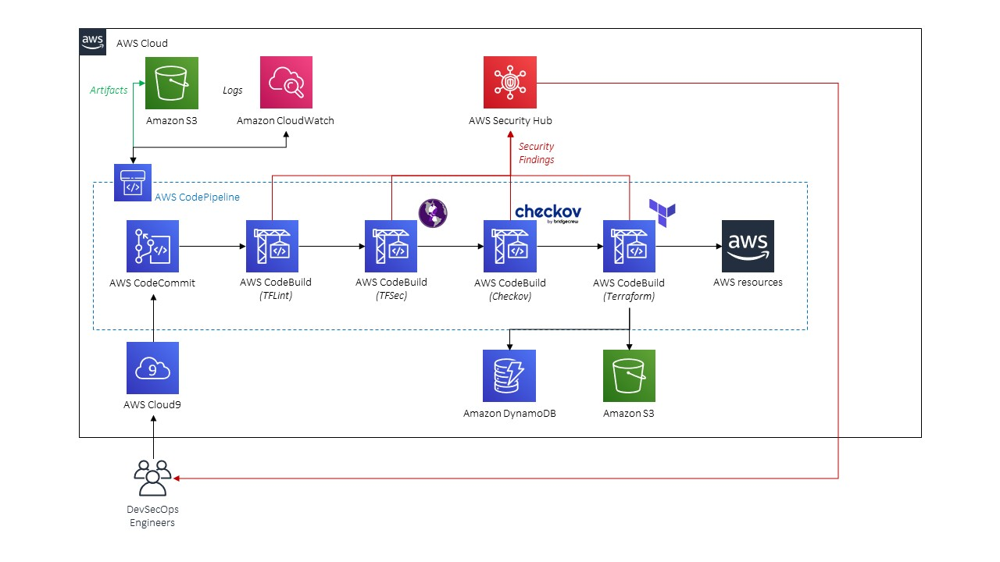

# Terraform Security Scanning - CodeSuite 
Sample implementation of a Terraform security testing pipeline using the AWS CodeSuite. CodeCommit is used as the SCM, CodeBuild projects are used as the CI servers and CodePipeline is the CD automation engine which will start builds as new code is pushed (directly or via PR) to the Master branch. The final build stage also applies your Terraform state and persists the `.tfstate` files into a S3 backend and uses Terraform to supply state locking for multiple builds.

This pipeline lints Terraform configurations files by using TFLint and looks for regex and high-entropy based secrets/sensitive values using Detect-Secrets. Various security static analysis is performed against the templates using TFSec and Checkov, respectively. A standalone project is used to bootstrap and apply the Terraform state. To avoid interpolation errors due to the `terraform` declaration within `provider.tf` not supporting variables, we use `envsubst` to pass into the CodeBuild environment variables into `provider.tf`.

All security findings will be sent to AWS Security Hub if any of the tests fail - that way you can keep track of them and use further downstream integrations such as PagerDuty, Azure DevOps or JIRA to take the Security Hub findings and parse them down as alerts / issues / bugs / etc. Those are provided as [add-ons in ElectricEye](https://github.com/jonrau1/ElectricEye/tree/master/add-ons)

## Solution architecture

## Getting Started
Clone this repository and upload `tf-devsecops.zip` to a bucket of your choosing. Deploy a stack from `tf-security-pipeline.yml` in your AWS account, all necessary artifacts will be pushed as the first commit to the created CodeCommit repository. 

The utilize the scanning utilities deployed in this solution, upload all Terraform configurations files to the `src/artifacts` subdirectory in the solution. You can view the individual CodeBuild buildspec's in `src/buildspecs/` and Security Hub integration scripts in `src/security-hub`

**Important Note:** Modify the permissions of the CodeBuild Role in `tf-security-pipeline.yml` to give it permissions for whatever you will be deploying with Terraform. In the basic example the CodeBuild role is given `'*'` resource access for S3:CreateBucket and S3:DeleteBucket to apply and destory the sample bucket in this pipeline.